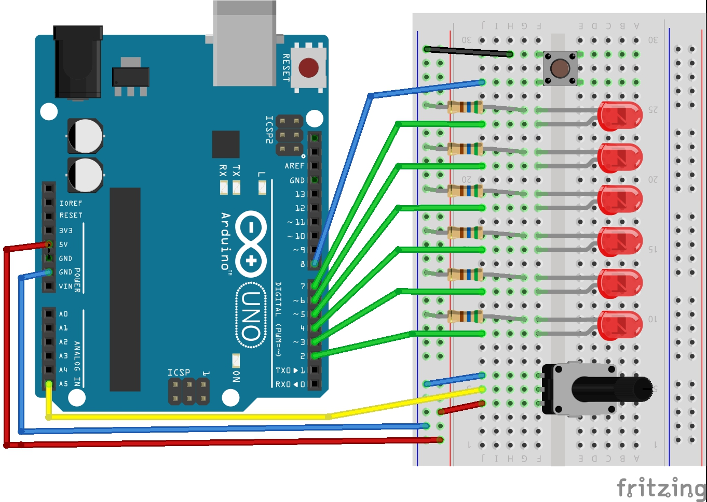
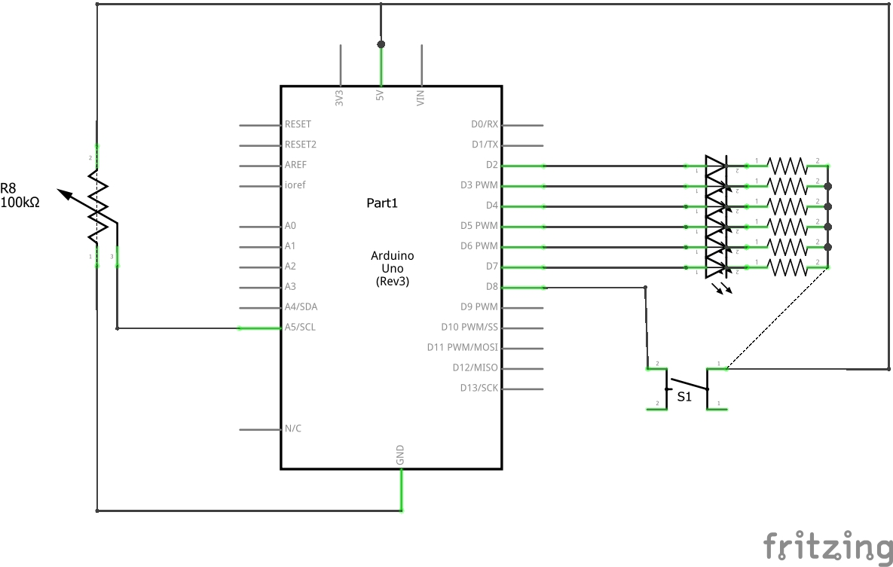

# Arduino-LedAnimations
<h1>Arduino Led Animations</h1>
<h3>Behavior:</h3>

	On power up the LEDs will blink 5 times meaning that all of the LEDs are working, this is the ledInit function running.
 	On the first button press (in theory if not caught up by the dealy functions that I couldn't find a clean way to get around) the leds will wave from right to left, with the speed of the animation being controlled by the pot.
 	Upon the second button press, you will be able to control which LED's are lit up based on the position of the pot. This is explained further in the code in the form of comments.
 	Finally, of the thrid button press there will be a wave animation of the LEDs, going from outside to inside then back to outside, once again, the speed of this animation will be controlled by the postiion of the pot.
 

<h3>Wriring</h3>

